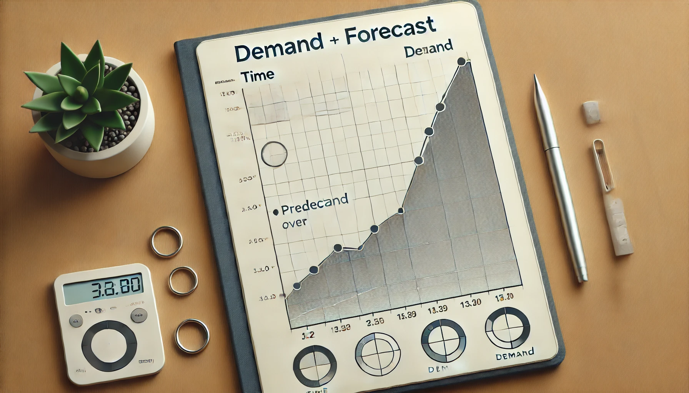

# Demand Forecasting

# 📊 Demand Forecasting Project  

## 1️⃣ Project Overview  
This project applies **time series forecasting** using **LightGBM** to predict sales for **50 products across 10 stores** over a three-month period. The dataset spans **five years (2013-01-01 to 2017-12-31)**.  

### Key Techniques Used:
- **Time series decomposition** (trend, seasonality, cyclical, residual components).  
- **Feature engineering** (date-based features, lag features, rolling windows, exponentially weighted features).  
- **Chronological train-test split** and **rolling/expanding window cross-validation**.  

### 📈 Business Insights & Forecast Results:
- **Predicted total sales for the next three months**: **2,558,788.02 items**.  
- **Top-performing stores:**  Stores **2, 3, and 8**.  
- **Lower-performing stores:**  Stores **5, 6, and 7**.  
- **Best-selling products:** **Items 15 and 28**.  
- **Least-sold product:**  **Item 5**.  

The forecasts align with historical sales patterns, demonstrating the importance of **seasonality, trends, and residual components** in sales predictions.  

This project follows a **real-world data science workflow**, adhering to the **CRISP-DM framework** and integrating best practices such as **exception handling, modular coding, version control, and virtual environments**, ensuring **reproducibility**.  

## 2️⃣ Technologies & Tools  
This project leverages the following technologies:  
- **Programming & Libraries:**  
  - Python (Pandas, NumPy, Matplotlib, Seaborn, Scikit-Learn, Statsmodels, Optuna)  
- **Development & Version Control:**  
  - Jupyter Notebook, Git, and GitHub  
- **Machine Learning & Statistical Methods:**  
  - Regression models, time series analysis  
- **Project Environment:**  
  - Anaconda (virtual environments) and Visual Studio Code  

# 3. Project structure
Each folder/file content and purpose is described below:

- Input: Stores all the input data used in the project.
- Models: Stores all the constructed models saved into pkl files.
- Notebooks: Contains exploratory data analysis and modelling jupyter notebooks.
- Reports: Stores all the images used for project documentation.
- Src: Contains all the scripts used in the project - artifacts_utils.py, modelling_utils.py and exception.py.
- Requirements, setup, gitignore, readme: The file setup.py allows me to build my entire project as a package, containing metadata and so on. Moreover, requirements.txt list all the dependencies needed for the project with the specific versions for reproducibility. Gitignore allows me to hide irrelevant information from commits and I am using readme.md for documentation and storytelling.

# 4. Business problem and project objectives
A retail store manager is strategizing to manage inventory and investments across 10 stores for 50 products, aiming to meet customer demand effectively. By employing predictive analytics, they aim to improve sales predictions, maintain product availability, and boost overall store performance.

Considering this, the project objectives are:
1. Identify valuable business insights about sales over time, like seasonal patterns, trends and general characteristics.
2. Construct a model able to accurately predict the sales for 50 items across 10 stores over a three-month period.
3. Determine financial results given by the project.

The project's financial outcomes will enable the manager to effectively oversee inventory and plan investments for growth, ensuring they meet customer demand and enhance overall store performance.

As a result, the business problem will be resolved.

# 5. Solution pipeline
The following pipeline was used, based on CRISP-DM framework

1. Business understanding.
2. Data understanding.
3. Data preparation.
4. Modelling.
5. Evaluation.
6. Deployment.

Each of these steps is approached in detail inside the notebooks.

